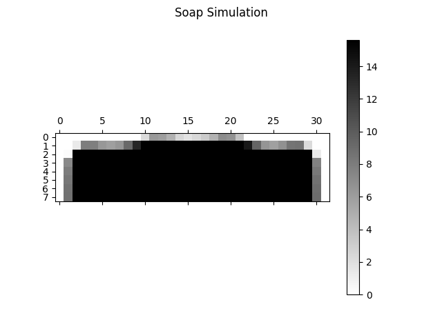

# Soap Simulation

Simulation of a bar of soap shrinking under a shower head of water.

This simulation only considers a cross section of the bar of soap.

## Depends On 

Python 3.9+, NumPy, and matplotlib

## To Download

`git clone https://github.com/TheOnceAndFutureSmalltalker/soap_simulation.git`

## To Execute

`python sim.py`
